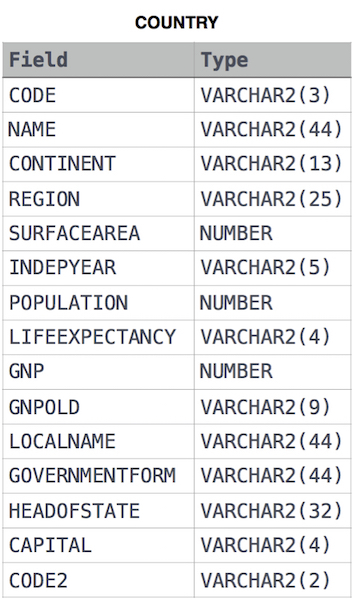

# Average Population of Each Continent

Given the **CITY** and **COUNTRY** tables, query the names of all the continents (COUNTRY.Continent) and their respective average city populations (CITY.Population) rounded down to the nearest integer.

**Note:** CITY.CountryCode and COUNTRY.Code are matching key columns.

**Input Format**

The **CITY** and **COUNTRY** tables are described as follows:




## Submitted Code

```sql
SELECT COUNTRY.CONTINENT, ROUND(AVG(CITY.POPULATION), 0)
  FROM CITY, COUNTRY
 WHERE CITY.COUNTRYCODE = COUNTRY.CODE
 GROUP BY COUNTRY.CONTINENT;
```
