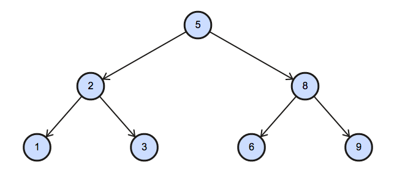

# Binary Tree Nodes

You are given a table, BST, containing two columns: N and P, where N represents the value of a node in Binary Tree, and P is the parent of N.


Write a query to find the node type of Binary Tree ordered by the value of the node. Output one of the following for each node:

* Root: If node is root node.
* Leaf: If node is leaf node.
* Inner: If node is neither root nor leaf node.

**Sample Input**


**Sample Output**

```
1 Leaf
2 Inner
3 Leaf
5 Root
6 Leaf
8 Inner
9 Leaf
```

**Explanation**

The Binary Tree below illustrates the sample:



## Submitted Code

```sql
SELECT N,
       CASE WHEN P IS NULL THEN 'Root'
            WHEN N IN (SELECT DISTINCT P
                         FROM BST)
                           THEN 'Inner'
                           ELSE 'Leaf'
        END
  FROM BST
 ORDER BY 1;
```
