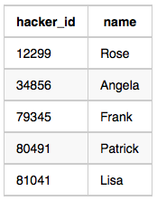

# Challenges

Julia asked her students to create some coding challenges. Write a query to print the hacker_id, name, and the total number of challenges created by each student. Sort your results by the total number of challenges in descending order. If more than one student created the same number of challenges, then sort the result by hacker_id. If more than one student created the same number of challenges and the count is less than the maximum number of challenges created, then exclude those students from the result.

**Input Format**

The following tables contain challenge data:

* Hackers: The hacker_id is the id of the hacker, and name is the name of the hacker.


* Challenges: The challenge_id is the id of the challenge, and hacker_id is the id of the student who created the challenge.


---

**Sample Input 0**

Hackers Table:


Challenges Table:


**Sample Output 0**

```
21283 Angela 6
88255 Patrick 5
96196 Lisa 1
```

**Sample Input 1**

Hackers Table:



Challenges Table:


**Sample Output 1**

```
12299 Rose 6
34856 Angela 6
79345 Frank 4
80491 Patrick 3
81041 Lisa 1
```

**Explanation**

For Sample Case 0, we can get the following details:


Students $5077$ and $62743$ both created $4$ challenges, but the maximum number of challenges created is $6$ so these students are excluded from the result.

For Sample Case 1, we can get the following details:


Students $12299$ and $34856$ both created $6$ challenges. Because $6$ is the maximum number of challenges created, these students are included in the result.

## Submitted Code

```sql
  WITH M AS (SELECT T.*,
                    COUNT(*) OVER(PARTITION BY cnt) AS dup_cnt
               FROM (SELECT H.hacker_id, H.name,
                            COUNT(*) AS cnt,
                            MAX(COUNT(*)) OVER() AS max_cnt
                       FROM Hackers H
                       JOIN Challenges C
                         ON H.hacker_id = C.hacker_id
                      GROUP BY H.hacker_id, H.name) T)
SELECT M.hacker_id, M.name, M.cnt
  FROM M
 WHERE NOT(M.cnt < M.max_cnt AND M.dup_cnt >= 2)
 ORDER BY 3 DESC, 1;
```
