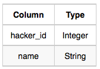

# Contest Leaderboard

You did such a great job helping Julia with her last coding contest challenge that she wants you to work on this one, too!

The total score of a hacker is the sum of their maximum scores for all of the challenges. Write a query to print the hacker_id, name, and total score of the hackers ordered by the descending score. If more than one hacker achieved the same total score, then sort the result by ascending hacker_id. Exclude all hackers with a total score of $0$ from your result.

**Input Format**

The following tables contain contest data:

* Hackers: The hacker_id is the id of the hacker, and name is the name of the hacker.



* Submissions: The submission_id is the id of the submission, hacker_id is the id of the hacker who made the submission, challenge_id is the id of the challenge for which the submission belongs to, and score is the score of the submission.


**Sample Input**

Hackers Table:


Submissions Table:


**Sample Output**

```
4071 Rose 191
74842 Lisa 174
84072 Bonnie 100
4806 Angela 89
26071 Frank 85
80305 Kimberly 67
49438 Patrick 43
```

**Explanation**

Hacker 4071 submitted solutions for challenges 19797 and 49593, so the total score $= 95 + max(43, 96) = 191$.

Hacker 74842 submitted solutions for challenges 19797 and 63132, so the total score $= max(98, 5) + 76 = 174$.

Hacker 84072 submitted solutions for challenges 49593 and 63132, so the total score $= 100 + 0 = 100$.

The total scores for hackers 4806, 26071, 80305, and 49438 can be similarly calculated.

## Submitted Code

```sql
SELECT H.hacker_id, H.name, SUM(S2.MAX_SCORE) AS TOTAL_SCORE
  FROM Hackers H, (SELECT S.hacker_id, S.challenge_id,
                          MAX(S.score) AS MAX_SCORE
                     FROM Submissions S
                    GROUP BY S.hacker_id, S.challenge_id) S2
 WHERE H.hacker_id = S2.hacker_id
 GROUP BY H.hacker_id, H.name
HAVING SUM(S2.MAX_SCORE) > 0
 ORDER BY 3 DESC, 1 ASC;
```
