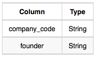
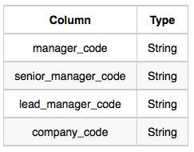
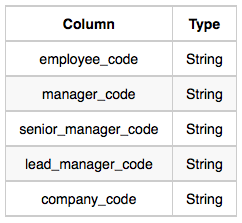
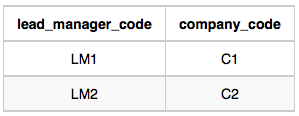
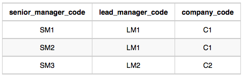
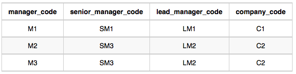

# New Companies

Amber's conglomerate corporation just acquired some new companies. Each of the companies follows this hierarchy:


Given the table schemas below, write a query to print the company_code, founder name, total number of lead managers, total number of senior managers, total number of managers, and total number of employees. Order your output by ascending company_code.

**Note:**

* The tables may contain duplicate records.
* The company_code is string, so the sorting should not be **numeric**. For example, if the company_codes are C_1, C_2, and C_10, then the ascending company_codes will be C_1, C_10, and C_2.

---

**Input Format**

The following tables contain company data:

* Company: The company_code is the code of the company and founder is the founder of the company.



* Lead_Manager: The lead_manager_code is the code of the lead manager, and the company_code is the code of the working company.


* Senior_Manager: The senior_manager_code is the code of the senior manager, the lead_manager_code is the code of its lead manager, and the company_code is the code of the working company.


* Manager: The manager_code is the code of the manager, the senior_manager_code is the code of its senior manager, the lead_manager_code is the code of its lead manager, and the company_code is the code of the working company.



* Employee: The employee_code is the code of the employee, the manager_code is the code of its manager, the senior_manager_code is the code of its senior manager, the lead_manager_code is the code of its lead manager, and the company_code is the code of the working company.



---

**Sample Input**

Company Table:


Lead_Manager Table:



Senior_Manager Table:



Manager Table:



Employee Table:


**Sample Output**

```
C1 Monika 1 2 1 2
C2 Samantha 1 1 2 2
```

**Explanation**

In company C1, the only lead manager is LM1. There are two senior managers, SM1 and SM2, under LM1. There is one manager, M1, under senior manager SM1. There are two employees, E1 and E2, under manager M1.

In company C2, the only lead manager is LM2. There is one senior manager, SM3, under LM2. There are two managers, M2 and M3, under senior manager SM3. There is one employee, E3, under manager M2, and another employee, E4, under manager, M3.

## Submitted Code

```sql
SELECT C.company_code, C.founder,
       COUNT(DISTINCT L.lead_manager_code),
       COUNT(DISTINCT S.senior_manager_code),
       COUNT(DISTINCT M.manager_code),
       COUNT(DISTINCT E.employee_code)
  FROM Company C, Lead_Manager L, 
       Senior_Manager S, Manager M, Employee E
 WHERE C.company_code = L.company_code(+)
   AND L.lead_manager_code = S.lead_manager_code(+)
   AND S.senior_manager_code = M.senior_manager_code(+)
   AND M.manager_code = E.manager_code(+)
 GROUP BY C.company_code, C.founder
 ORDER BY 1 ASC;
```
