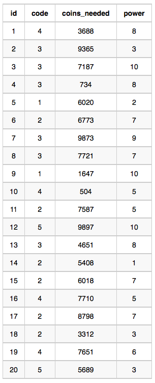
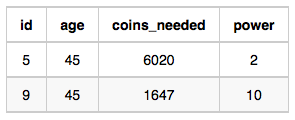
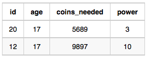

# Ollivander's Inventory

Harry Potter and his friends are at Ollivander's with Ron, finally replacing Charlie's old broken wand.

Hermione decides the best way to choose is by determining the minimum number of gold galleons needed to buy each non-evil wand of high power and age. Write a query to print the id, age, coins_needed, and power of the wands that Ron's interested in, sorted in order of descending power. If more than one wand has same power, sort the result in order of descending age.

**Input Format**

The following tables contain data on the wands in Ollivander's inventory:

* Wands: The id is the id of the wand, code is the code of the wand, coins_needed is the total number of gold galleons needed to buy the wand, and power denotes the quality of the wand (the higher the power, the better the wand is).


* Wands_Property: The code is the code of the wand, age is the age of the wand, and is_evil denotes whether the wand is good for the dark arts. If the value of is_evil is 0, it means that the wand is not evil. The mapping between code and age is one-one, meaning that if there are two pairs, $(code_1, age_1)$ and $(code_2, age_2)$, then $code_1 \neq code_2$ and $age_1 \neq age_2$.


---

**Sample Input**

Wands Table:



Wands_Property Table:


**Sample Output**

```
9 45 1647 10
12 17 9897 10
1 20 3688 8
15 40 6018 7
19 20 7651 6
11 40 7587 5
10 20 504 5
18 40 3312 3
20 17 5689 3
5 45 6020 2
14 40 5408 1
```

**Explanation**

The data for wands of age 45 (code 1):



* The minimum number of galleons needed for $wand(age = 45, power = 2) = 6020$
* The minimum number of galleons needed for $wand(age = 45, power = 10) = 1647$

The data for wands of age 40 (code 2):


* The minimum number of galleons needed for $wand(age = 40, power = 1) = 5408$
* The minimum number of galleons needed for $wand(age = 40, power = 3) = 3312$
* The minimum number of galleons needed for $wand(age = 40, power = 5) = 7587$
* The minimum number of galleons needed for $wand(age = 40, power = 7) = 6018$

The data for wands of age 20 (code 4):


* The minimum number of galleons needed for $wand(age = 20, power = 5) = 504$
* The minimum number of galleons needed for $wand(age = 20, power = 6) = 7651$
* The minimum number of galleons needed for $wand(age = 20, power = 8) = 3688$

The data for wands of age 17 (code 5):



* The minimum number of galleons needed for $wand(age = 17, power = 3) = 5689$
* The minimum number of galleons needed for $wand(age = 17, power = 10) = 9897$

## Submitted Code

```sql
SELECT W.id, P.age, W.coins_needed, W.power
  FROM Wands W
  JOIN Wands_Property P
    ON W.code = P.code
  JOIN (SELECT P.code, W.power,
               MIN(W.coins_needed) AS min_coins
          FROM Wands W
          JOIN Wands_Property P
            ON W.code = P.code
         WHERE P.is_evil = 0
         GROUP BY P.code, W.power) T
    ON W.code = T.code
   AND W.power = T.power
 WHERE W.coins_needed = T.min_coins
 ORDER BY 4 DESC, 2 DESC;
```
