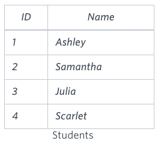
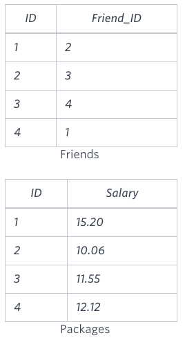
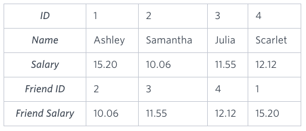

# Placements

You are given three tables: Students, Friends and Packages. Students contains two columns: ID and Name. Friends contains two columns: ID and Friend_ID (ID of the ONLY best friend). Packages contains two columns: ID and Salary (offered salary in $ thousands per month).


Write a query to output the names of those students whose best friends got offered a higher salary than them. Names must be ordered by the salary amount offered to the best friends. It is guaranteed that no two students got same salary offer.

**Sample Input**





**Sample Output**

```
Samantha
Julia
Scarlet
```

**Explanation**

See the following table:



Now,

* Samantha's best friend got offered a higher salary than her at 11.55
* Julia's best friend got offered a higher salary than her at 12.12
* Scarlet's best friend got offered a higher salary than her at 15.2
* Ashley's best friend did NOT get offered a higher salary than her

The name output, when ordered by the salary offered to their friends, will be:

* Samantha
* Julia
* Scarlet

## Submitted Code

```sql
SELECT S.Name
  FROM Students S, Packages P1, Friends F, Packages P2
 WHERE S.ID = P1.ID
   AND S.ID = F.ID
   AND F.Friend_ID = P2.ID
   AND P1.Salary < P2.Salary
 ORDER BY P2.Salary;
```
