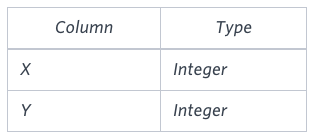

# Symmetric Pairs

You are given a table, Functions, containing two columns: X and Y.



Two pairs (X1, Y1) and (X2, Y2) are said to be symmetric pairs if X1 = Y2 and X2 = Y1.

Write a query to output all such symmetric pairs in ascending order by the value of X. List the rows such that X1 ≤ Y1.

**Sample Input**


Sample Output

```
20 20
20 21
22 23
```

## Submitted Code

```sql
SELECT F1.X, F1.Y
  FROM Functions F1, Functions F2
 WHERE F1.X = F2.Y
   AND F1.Y = F2.X
 GROUP BY F1.X, F1.Y
HAVING F1.X < F1.Y   -- Case 1: X != Y
    OR COUNT(*) > 1  -- Case 2: X = Y
 ORDER BY F1.X;
```
