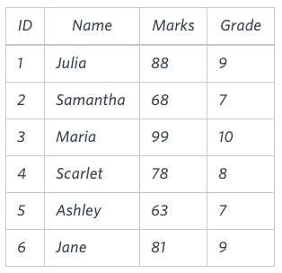

# The Report

You are given two tables: Students and Grades. Students contains three columns ID, Name and Marks.


Grades contains the following data:


Ketty gives Eve a task to generate a report containing three columns: Name, Grade and Mark. Ketty doesn't want the NAMES of those students who received a grade lower than 8. The report must be in descending order by grade -- i.e. higher grades are entered first. If there is more than one student with the same grade (8-10) assigned to them, order those particular students by their name alphabetically. Finally, if the grade is lower than 8, use "NULL" as their name and list them by their grades in descending order. If there is more than one student with the same grade (1-7) assigned to them, order those particular students by their marks in ascending order.

Write a query to help Eve.

**Sample Input**


**Sample Output**

```
Maria 10 99
Jane 9 81
Julia 9 88 
Scarlet 8 78
NULL 7 63
NULL 7 68
```

**Note**

Print "NULL" as the name if the grade is less than 8.

**Explanation**

Consider the following table with the grades assigned to the students:



So, the following students got 8, 9 or 10 grades:

* Maria (grade 10)
* Jane (grade 9)
* Julia (grade 9)
* Scarlet (grade 8)

## Submitted Code

```sql
SELECT *
  FROM (SELECT S.Name, G.Grade, S.Marks
          FROM Students S, Grades G
         WHERE S.Marks BETWEEN G.Min_Mark AND G.Max_Mark
           AND G.Grade >= 8
         ORDER BY 2 DESC, 1 ASC)
 UNION ALL
SELECT *
  FROM (SELECT REPLACE(S.Name, S.Name, 'NULL'),
               G.Grade, S.Marks
          FROM Students S, Grades G
         WHERE S.Marks BETWEEN G.Min_Mark AND G.Max_Mark
           AND G.Grade < 8
         ORDER BY 2 DESC, 3 ASC);
```
